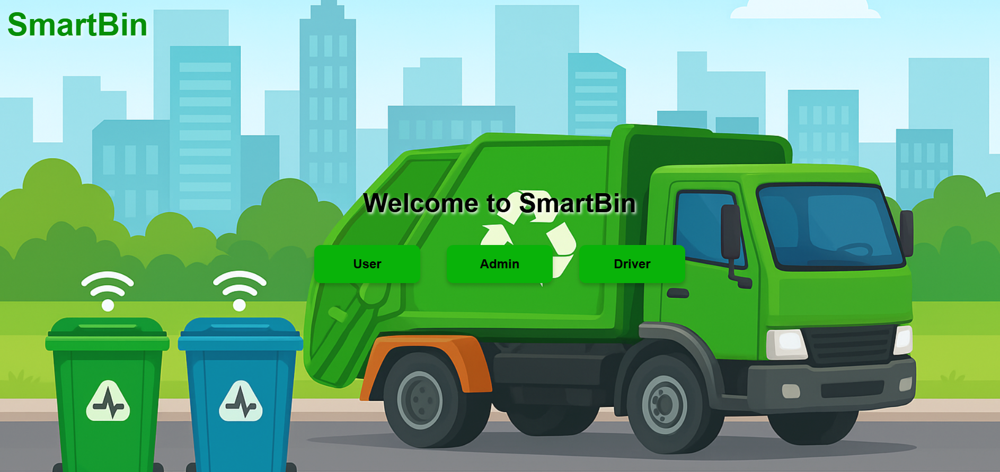
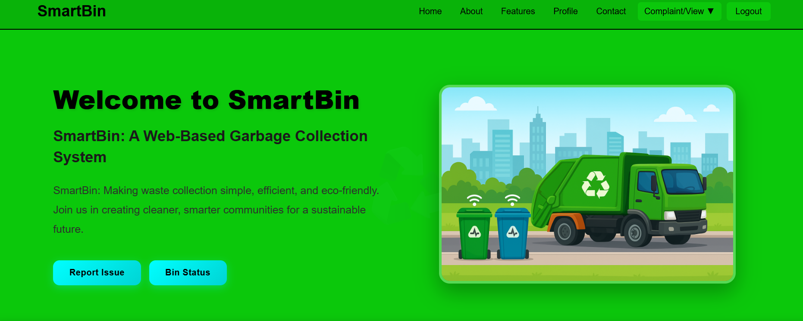
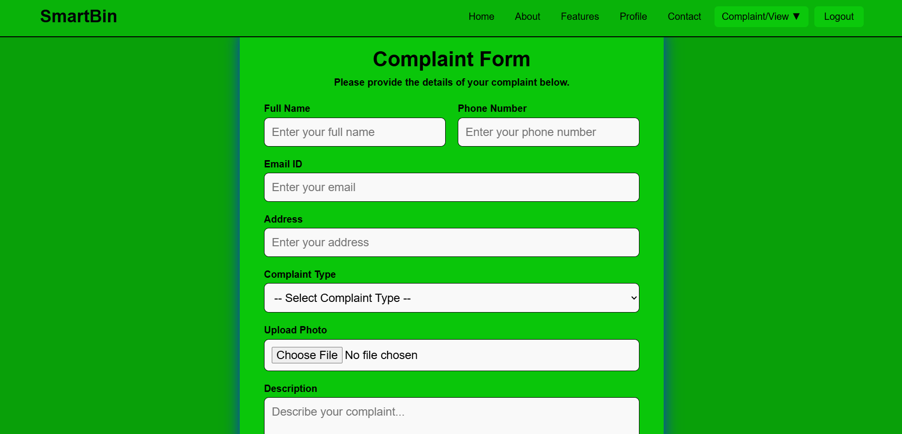
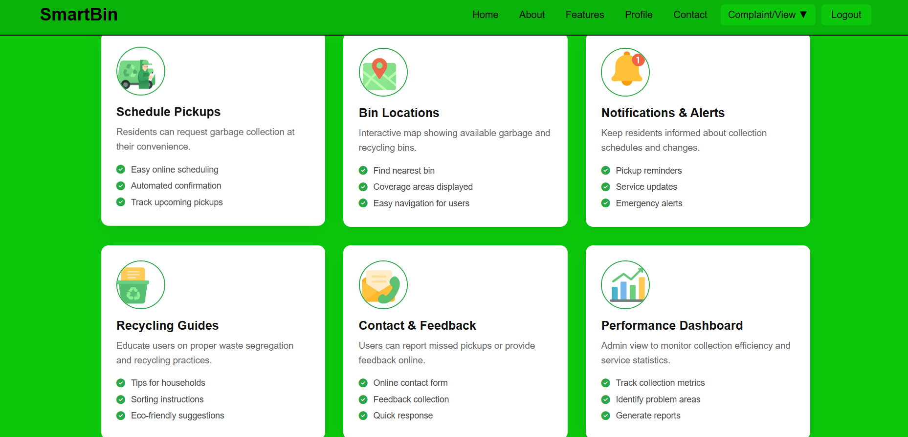
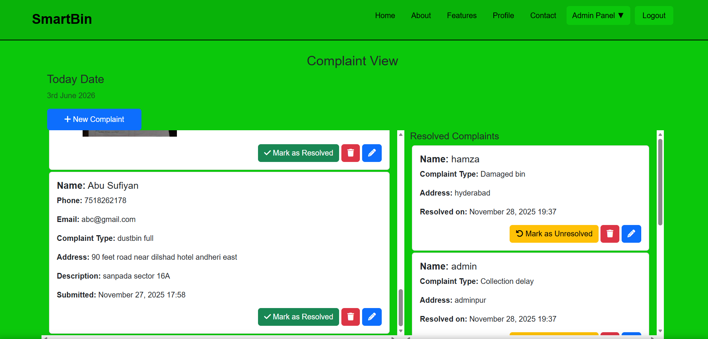

# ♻️ SmartBin - Smart Waste Management System

## 📌 Overview

SmartBin is a web-based waste management and complaint monitoring system developed using Django. The platform enables citizens to report waste-related issues, upload images, share location details, and track complaint status in real time.

The system provides dedicated dashboards for users, administrators, and drivers, helping municipalities streamline garbage collection operations and improve waste management efficiency.

---

## 🚀 Features

### 👤 User Module

* User Registration & Login
* Report waste-related complaints
* Upload complaint images
* Share location details
* Track complaint status
* View bin information and updates

### 🛠️ Admin Module

* Manage complaints
* Monitor complaint status
* Mark issues as resolved
* View analytics dashboard
* Generate reports
* Track service performance

### 🚛 Driver Module

* View collection assignments
* Access complaint locations
* Update collection status
* Track daily pickup activities

### 📊 Analytics Dashboard

* Complaint statistics
* Area-wise complaint tracking
* Waste collection monitoring
* Performance reports
* Data visualization using charts

### 🌍 Smart Waste Management

* Digital complaint management
* Location-based reporting
* Image-based issue tracking
* Improved waste collection workflow
* Better communication between citizens and authorities

---

## 🛠️ Tech Stack

* Python
* Django
* SQLite
* HTML5
* CSS3
* JavaScript
* Bootstrap

---

## 📷 Screenshots

### Role

### Home Page

### Complaint Form

### Features Page

### Admin Complaint View

---

## 🎯 Project Objective

The objective of SmartBin is to digitize waste management operations by providing an efficient platform for reporting, tracking, and resolving garbage-related issues. The system helps improve cleanliness, transparency, and service efficiency within urban communities.

---

## 👨‍💻 Developer

**Abusufiyan**

Python Developer | Django Developer | Full Stack Developer
